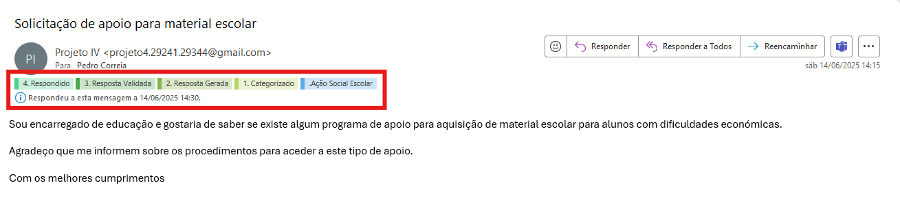

# 📩 Open Source Plugin for E-mail Automation using Large Language Models A proposal

## Architecture Diagram

    

## 📚 Project Context

This project aims to develop an add-on for email services, initially targeting Gmail. The add-on will have the capability to categorize emails using keyword matching and generate responses based on Retrieval-Augmented Generation (RAG) through Large Language Models (LLMs). It will also provide the ability to create a timeline tracking each email from categorization to response, including stages such as generated response and validated response. Finally, this system is intended to be integrated with a government institution, specifically the Municipality of the north of Portugal.

## 🚀 Project Deploy

Once the add-on is partially developed, it will be published on Google Workspace, allowing the service to run server-side and be installed directly within Gmail.

## ✨ Add-on Features

**1. Categorized Mail Box**

Gmail

    

Outlook

    

**2. Response Generated for the email**

Gmail

    

Outlook

    

**3. Email after the generated response has been validated**
Gmail

    

Outlook

    

